## 饼图

### 基础饼图

```html
<html lang="en">
<head>
    <meta charset="UTF-8">
    <title>基础饼图</title>

    <script src="./js/echarts.js"></script>

</head>

<style>
    #container {
        width: 70vw;
        height: 70vh;
        position: absolute;
        top: 50%;
        left: 50%;
        transform: translate(-50%, -50%);
    }
</style>
<body>
<div id="container"></div>
<script>
    //初始化echarts实例
    var chart = echarts.init(document.getElementById('container'));

    // 指定图表的配置项和数据
    var option =
        {

            tooltip: {
                trigger: 'item'
            },
            legend: {
                orient: 'vertical',
                left: 'left'
            },
            series: [
                {
                    data: (function ()
                    {
                        var data = [];
                        for (let i = 0; i < 10; i++)
                        {
                            data.push(
                                {
                                    name: "测试" + (i + 1),
                                    value: Math.round(Math.random() * 600 + 100)
                                }
                            )
                        }
                        return data;
                    }()),
                    type: 'pie',
                }
            ]
        };

    //使用刚指定的配置项和数据显示图表
    chart.setOption(option);

</script>

</body>
</html>

```


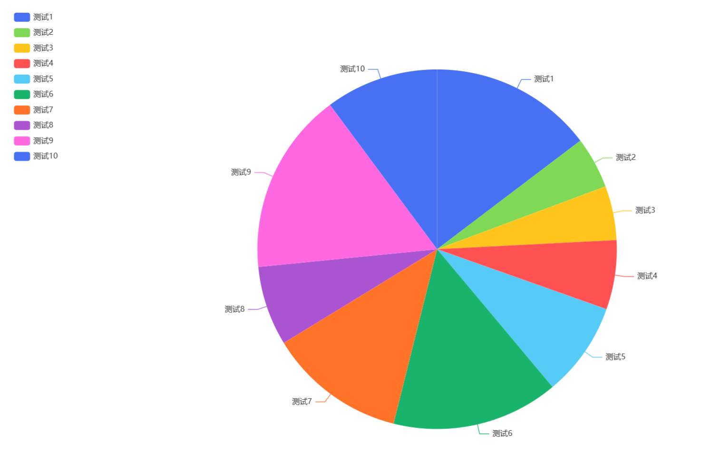


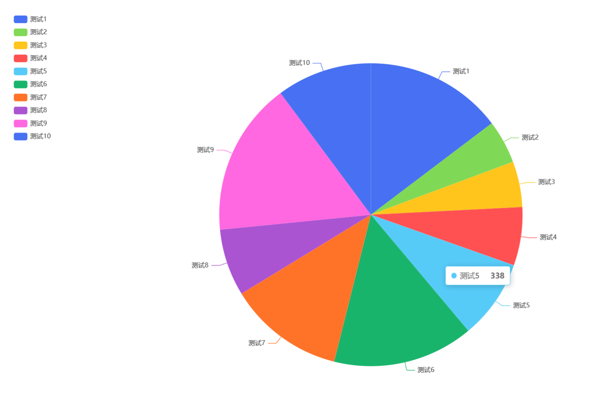


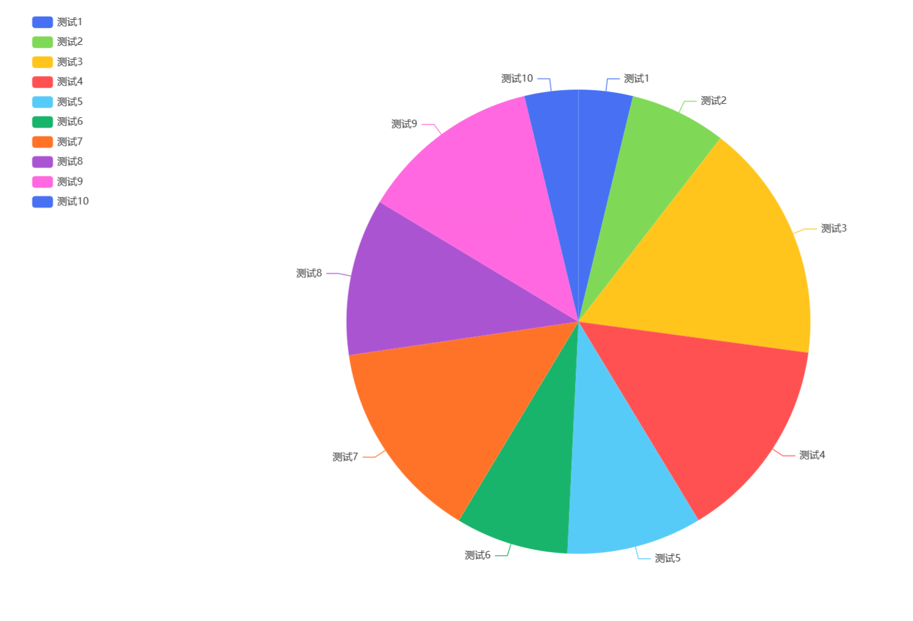


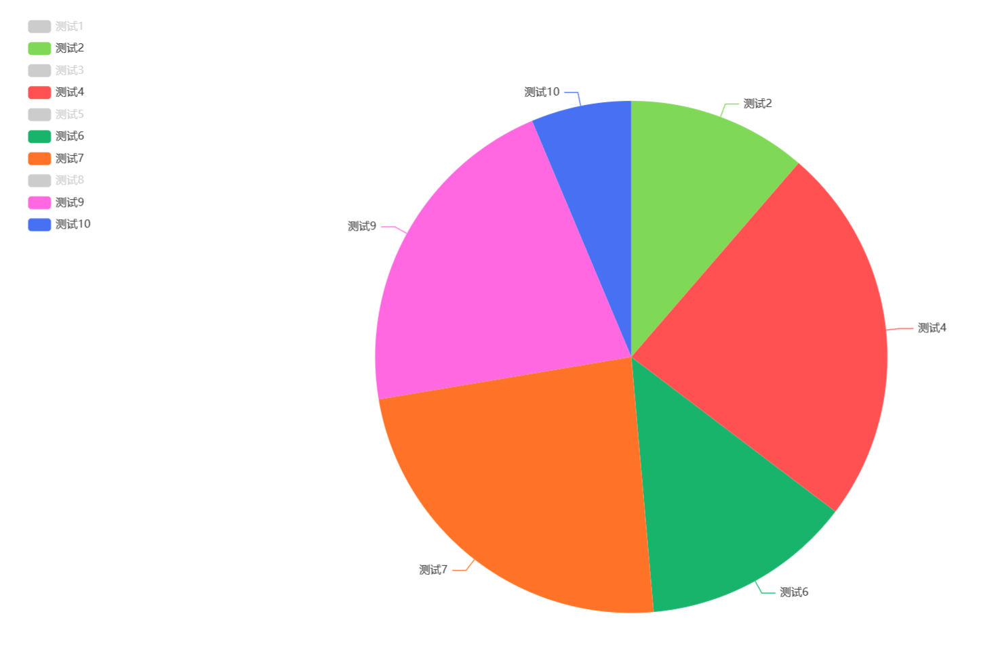


### 环形图

```html
<html lang="en">
<head>
    <meta charset="UTF-8">
    <title>环形图</title>

    <script src="./js/echarts.js"></script>

</head>

<style>
    #container {
        width: 70vw;
        height: 70vh;
        position: absolute;
        top: 50%;
        left: 50%;
        transform: translate(-50%, -50%);
    }
</style>
<body>
<div id="container"></div>
<script>
    //初始化echarts实例
    var chart = echarts.init(document.getElementById('container'));

    // 指定图表的配置项和数据
    var option =
        {

            tooltip: {
                trigger: 'item'
            },
            legend: {
                orient: 'vertical',
                left: 'left'
            },
            series: [
                {
                    radius: ['35%', '95%'],
                    avoidLabelOverlap: false,
                    /*label: {
                        show: false,
                        position: 'center'
                    },*/
                    emphasis: {
                        label: {
                            show: true,
                            fontSize: 30,
                            fontWeight: 'bold'
                        }
                    },

                    data: (function ()
                    {
                        var data = [];
                        for (let i = 0; i < 10; i++)
                        {
                            data.push(
                                {
                                    name: "测试" + (i + 1),
                                    value: Math.round(Math.random() * 600 + 100)
                                }
                            )
                        }
                        return data;
                    }()),
                    type: 'pie',
                }
            ]
        };

    //使用刚指定的配置项和数据显示图表
    chart.setOption(option);

</script>

</body>
</html>

```


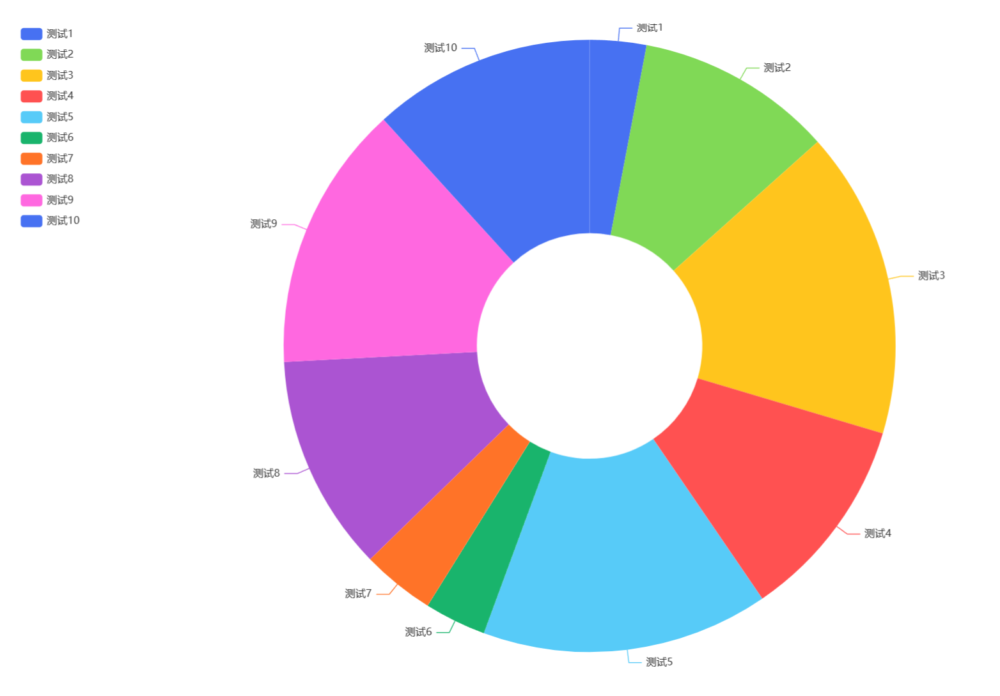


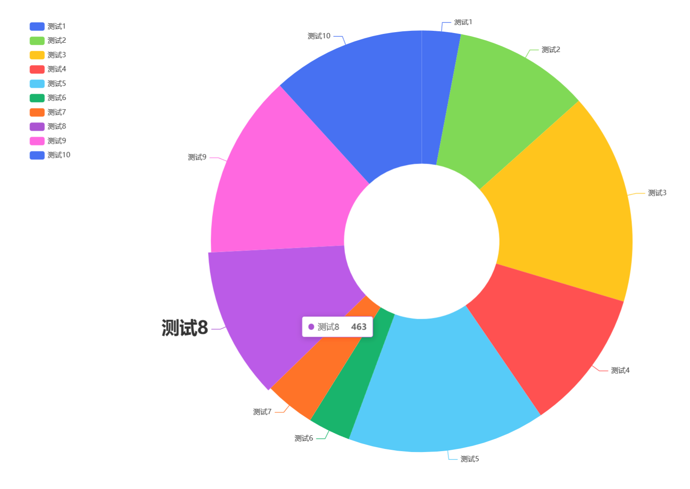


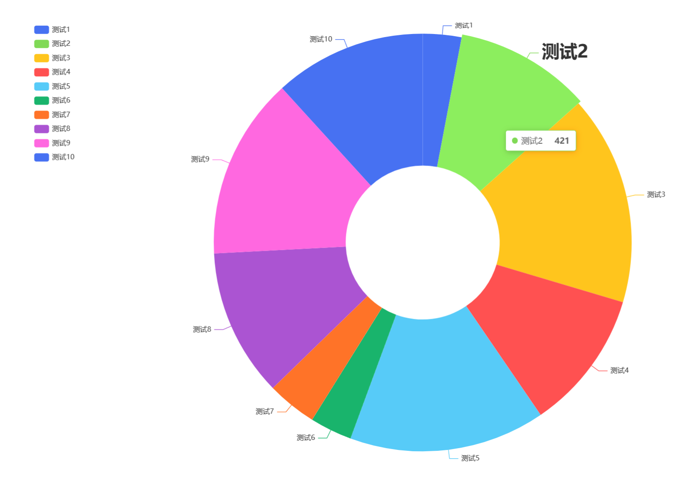


```html
<html lang="en">
<head>
    <meta charset="UTF-8">
    <title>环形图</title>

    <script src="./js/echarts.js"></script>

</head>

<style>
    #container {
        width: 70vw;
        height: 70vh;
        position: absolute;
        top: 50%;
        left: 50%;
        transform: translate(-50%, -50%);
    }
</style>
<body>
<div id="container"></div>
<script>
    //初始化echarts实例
    var chart = echarts.init(document.getElementById('container'));

    // 指定图表的配置项和数据
    var option =
        {

            tooltip: {
                trigger: 'item'
            },
            legend: {
                orient: 'vertical',
                left: 'left'
            },
            series: [
                {
                    radius: ['60%', '90%'],
                    avoidLabelOverlap: false,
                    label: {
                        show: false,
                        position: 'center'
                    },
                    emphasis: {
                        label: {
                            show: true,
                            fontSize: 50,
                            fontWeight: 'bold'
                        }
                    },

                    data: (function ()
                    {
                        var data = [];
                        for (let i = 0; i < 10; i++)
                        {
                            data.push(
                                {
                                    name: "测试" + (i + 1),
                                    value: Math.round(Math.random() * 600 + 100)
                                }
                            )
                        }
                        return data;
                    }()),
                    type: 'pie',
                }
            ]
        };

    //使用刚指定的配置项和数据显示图表
    chart.setOption(option);

</script>

</body>
</html>
```


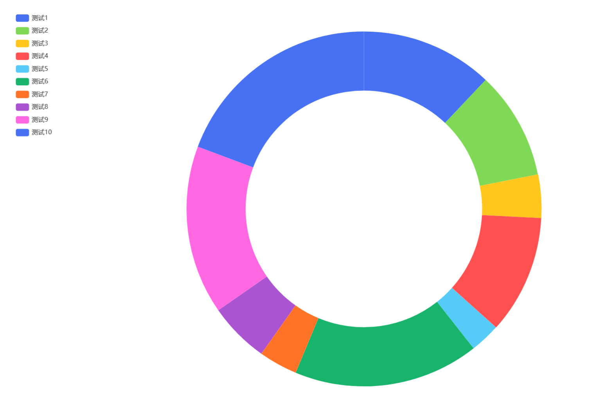


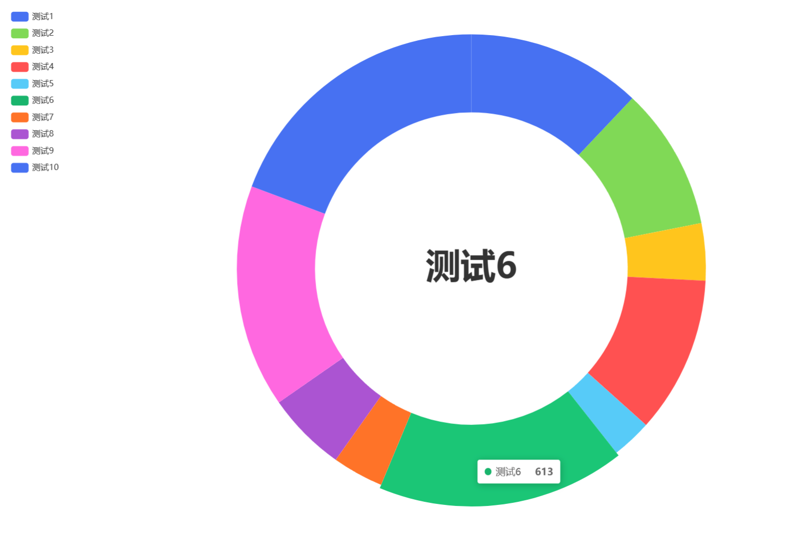


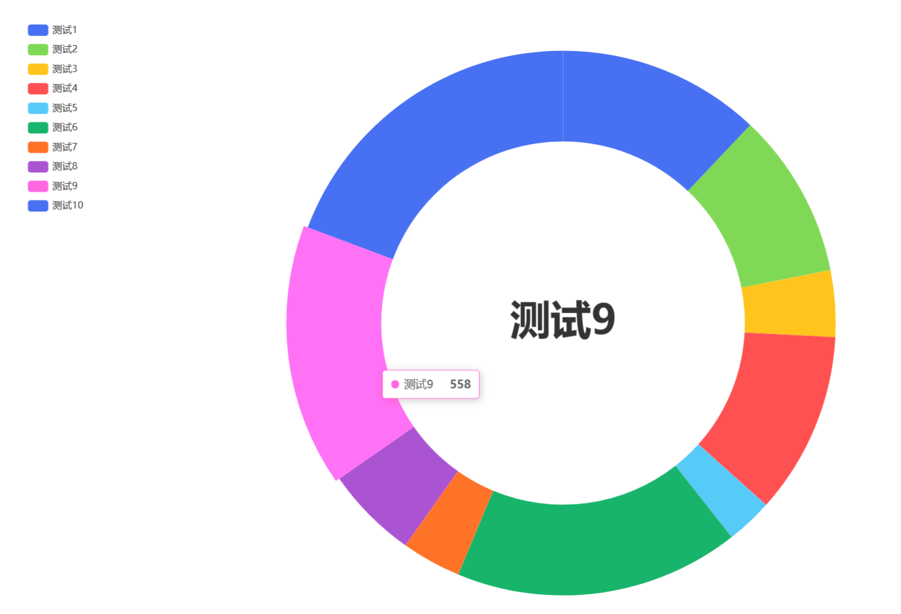


### 半环形图

```html
<html lang="en">
<head>
    <meta charset="UTF-8">
    <title>半环形图</title>

    <script src="./js/echarts.js"></script>

</head>

<style>
    #container {
        width: 70vw;
        height: 70vh;
        position: absolute;
        top: 50%;
        left: 50%;
        transform: translate(-50%, -50%);
    }
</style>
<body>
<div id="container"></div>
<script>
    //初始化echarts实例
    var chart = echarts.init(document.getElementById('container'));

    // 指定图表的配置项和数据
    var option =
        {

            tooltip: {
                trigger: 'item'
            },
            legend: {
                orient: 'vertical',
                left: 'left',
                selectedMode: false
            },
            series: [
                {
                    radius: ['35%', '95%'],
                    center: ['50%', '70%'],
                    startAngle: 180,
                    label: {
                        show: true,
                        formatter(param)
                        {
                            return param.name + ' (' + param.percent * 2 + '%)';
                        }
                    },
                    avoidLabelOverlap: false,
                    /*label: {
                        show: false,
                        position: 'center'
                    },*/
                    emphasis: {
                        label: {
                            show: true,
                            fontSize: 30,
                            fontWeight: 'bold'
                        }
                    },

                    data: (function ()
                    {
                        var data = [];
                        for (let i = 0; i < 10; i++)
                        {
                            data.push(
                                {
                                    name: "测试" + (i + 1),
                                    value: Math.round(Math.random() * 600 + 100)
                                }
                            )
                        }
                        var total = 0;
                        for (let i = 0; i < data.length; i++)
                        {
                            total += data[i].value;
                        }
                        console.log(data);
                        console.log(total);
                        data.push({
                            //最后面的50%不显示
                            value: total,
                            itemStyle: {
                                // stop the chart from rendering this piece
                                color: 'none',
                                decal: {
                                    symbol: 'none'
                                }
                            },
                            label: {
                                show: false
                            }
                        })

                        return data;
                    }()),
                    type: 'pie',
                }
            ]
        };

    //使用刚指定的配置项和数据显示图表
    chart.setOption(option);

</script>

</body>
</html>
```


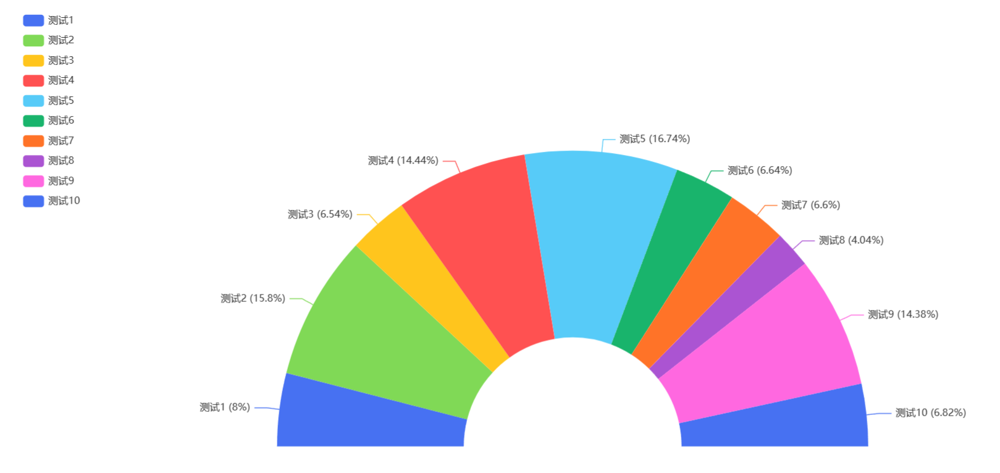


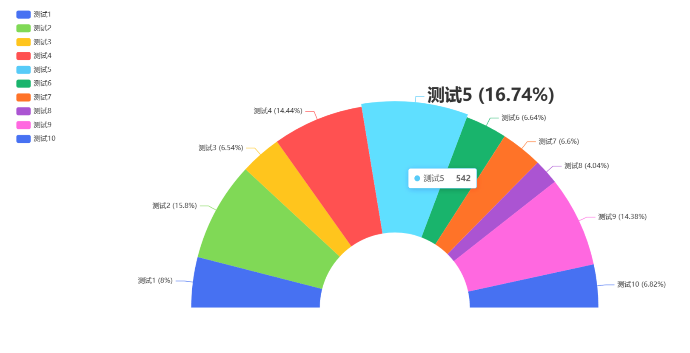


### 基础南丁格尔玫瑰图

```html
<html lang="en">
<head>
    <meta charset="UTF-8">
    <title>基础南丁格尔玫瑰图</title>

    <script src="./js/echarts.js"></script>

</head>

<style>
    #container {
        width: 70vw;
        height: 70vh;
        position: absolute;
        top: 50%;
        left: 50%;
        transform: translate(-50%, -50%);
    }
</style>
<body>
<div id="container"></div>
<script>
    //初始化echarts实例
    var chart = echarts.init(document.getElementById('container'));

    // 指定图表的配置项和数据
    var option =
        {

            tooltip: {
                trigger: 'item'
            },
            legend: {
                orient: 'vertical',
                left: 'left'
            },
            series: [
                {
                    data: (function ()
                    {
                        var data = [];
                        for (let i = 0; i < 10; i++)
                        {
                            data.push(
                                {
                                    name: "测试" + (i + 1),
                                    value: Math.round(Math.random() * 600 + 100)
                                }
                            )
                        }
                        return data;
                    }()),
                    type: 'pie',
                    roseType: 'area',
                }
            ]
        };

    //使用刚指定的配置项和数据显示图表
    chart.setOption(option);

</script>

</body>
</html>
```


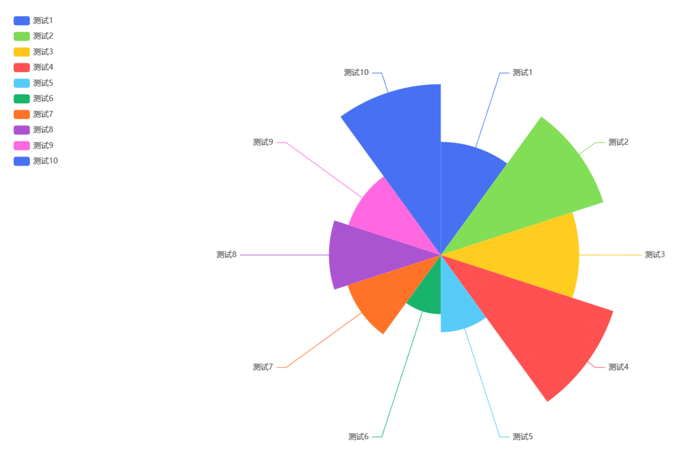


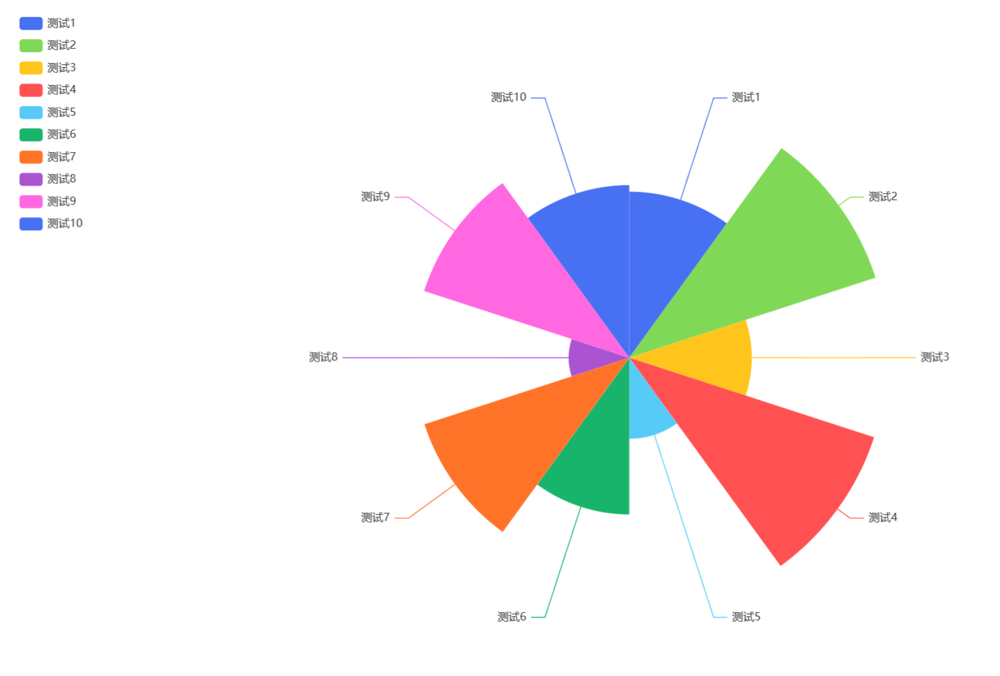


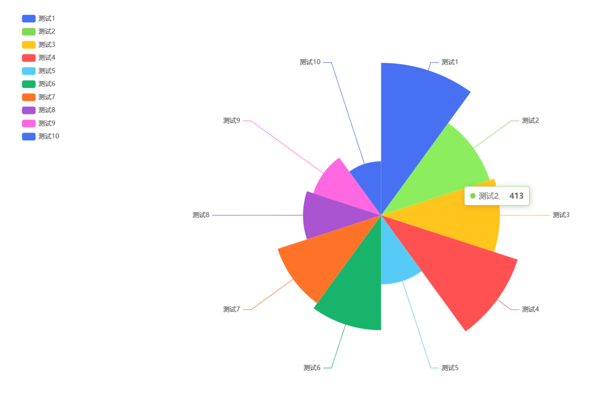


### 南丁格尔玫瑰图

```html
<html lang="en">
<head>
    <meta charset="UTF-8">
    <title>南丁格尔玫瑰图</title>

    <script src="./js/echarts.js"></script>

</head>

<style>
    #container {
        width: 70vw;
        height: 70vh;
        position: absolute;
        top: 50%;
        left: 50%;
        transform: translate(-50%, -50%);
    }
</style>
<body>
<div id="container"></div>
<script>
    //初始化echarts实例
    var chart = echarts.init(document.getElementById('container'));

    // 指定图表的配置项和数据
    var option =
        {

            tooltip: {
                trigger: 'item'
            },
            legend: {
                orient: 'vertical',
                left: 'left'
            },
            series: [
                {
                    data: (function ()
                    {
                        var data = [];
                        for (let i = 0; i < 10; i++)
                        {
                            data.push(
                                {
                                    name: "测试" + (i + 1),
                                    value: Math.round(Math.random() * 600 + 100)
                                }
                            )
                        }
                        return data;
                    }()),
                    name: "南丁格尔玫瑰图1",
                    type: 'pie',
                    roseType: 'area',
                    radius: [20, 200],
                    center: ['25%', '50%'],
                    itemStyle: {
                        borderRadius: 5
                    },
                },
                {
                    data: (function ()
                    {
                        var data = [];
                        for (let i = 0; i < 10; i++)
                        {
                            data.push(
                                {
                                    name: "测试" + (i + 1),
                                    value: Math.round(Math.random() * 600 + 100)
                                }
                            )
                        }
                        return data;
                    }()),
                    name: "南丁格尔玫瑰图2",
                    type: 'pie',
                    roseType: 'radius',
                    radius: [20, 200],
                    center: ['75%', '50%'],
                    itemStyle: {
                        borderRadius: 5
                    },
                    label: {
                        show: false
                    },
                    emphasis: {
                        label: {
                            show: true
                        }
                    },
                }
            ]
        };

    //使用刚指定的配置项和数据显示图表
    chart.setOption(option);

</script>

</body>
</html>
```


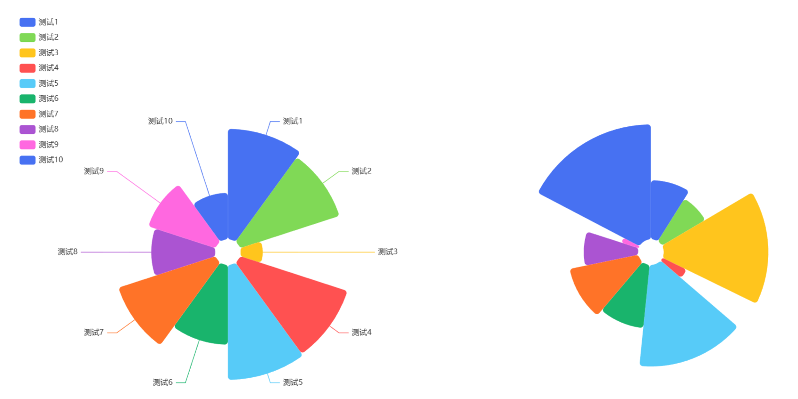


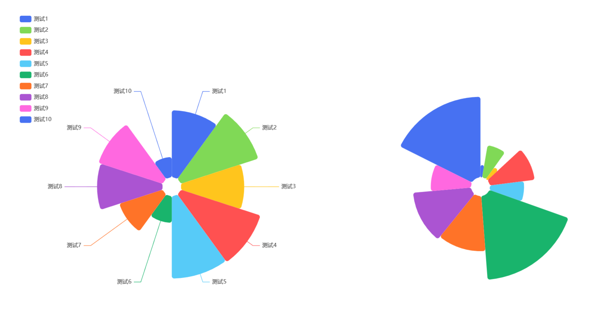


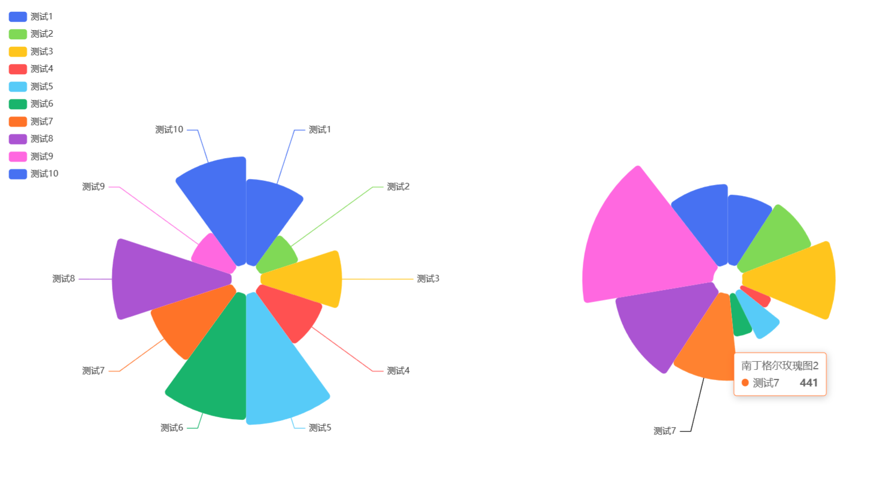


### 可滚动的图例

不可滚动的图例

```html
<html lang="en">
<head>
    <meta charset="UTF-8">
    <title>可滚动的图例</title>

    <script src="./js/echarts.js"></script>

</head>

<style>
    #container {
        width: 70vw;
        height: 70vh;
        position: absolute;
        top: 50%;
        left: 50%;
        transform: translate(-50%, -50%);
    }
</style>
<body>
<div id="container"></div>
<script>
    //初始化echarts实例
    var chart = echarts.init(document.getElementById('container'));

    // 指定图表的配置项和数据
    var option =
        {

            tooltip: {
                trigger: 'item'
            },
            legend: {
                orient: 'vertical',
                left: 'left'
            },
            series: [
                {
                    data: (function ()
                    {
                        var data = [];
                        for (let i = 0; i < 120; i++)
                        {
                            data.push(
                                {
                                    name: "测试" + (i + 1),
                                    value: Math.round(Math.random() * 600 + 100)
                                }
                            )
                        }
                        return data;
                    }()),
                    type: 'pie',
                }
            ]
        };

    //使用刚指定的配置项和数据显示图表
    chart.setOption(option);

</script>

</body>
</html>
```


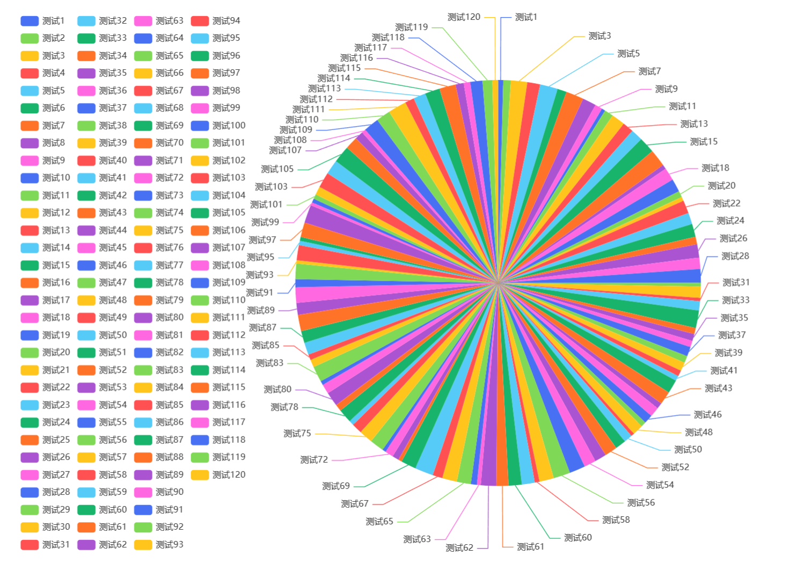


可滚动的图例

```html
<html lang="en">
<head>
    <meta charset="UTF-8">
    <title>可滚动的图例</title>

    <script src="./js/echarts.js"></script>

</head>

<style>
    #container {
        width: 70vw;
        height: 70vh;
        position: absolute;
        top: 50%;
        left: 50%;
        transform: translate(-50%, -50%);
    }
</style>
<body>
<div id="container"></div>
<script>
    //初始化echarts实例
    var chart = echarts.init(document.getElementById('container'));

    // 指定图表的配置项和数据
    var option =
        {
            tooltip: {
                trigger: 'item'
            },
            legend: {
                orient: 'vertical',
                left: 'left',
                type: 'scroll',
                right: 10,
                top: 20,
                bottom: 20,
            },
            series: [
                {
                    data: (function ()
                    {
                        var data = [];
                        for (let i = 0; i < 120; i++)
                        {
                            data.push(
                                {
                                    name: "测试" + (i + 1),
                                    value: Math.round(Math.random() * 600 + 100)
                                }
                            )
                        }
                        return data;
                    }()),
                    type: 'pie',
                }
            ]
        };

    //使用刚指定的配置项和数据显示图表
    chart.setOption(option);

</script>

</body>
</html>
```


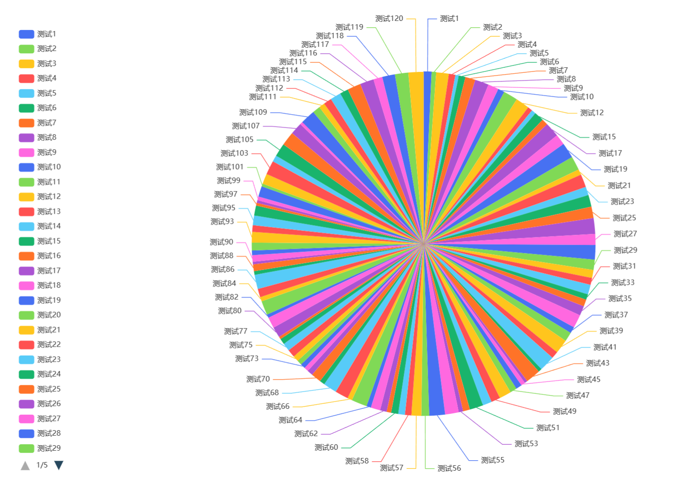


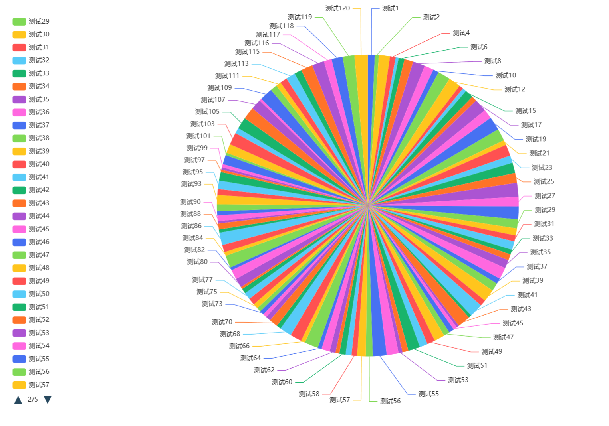


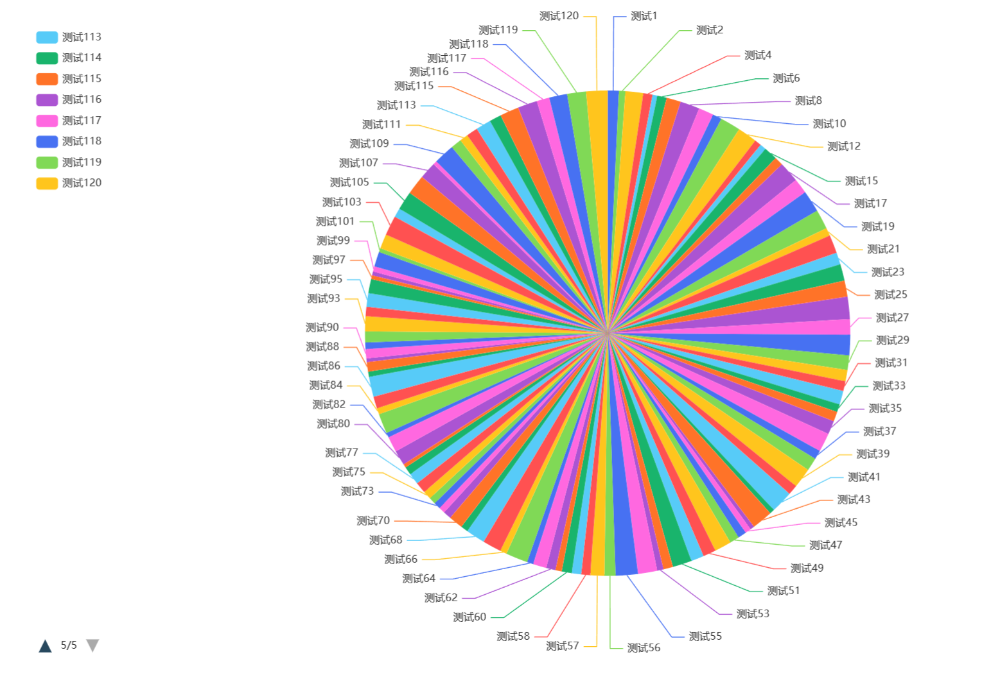


